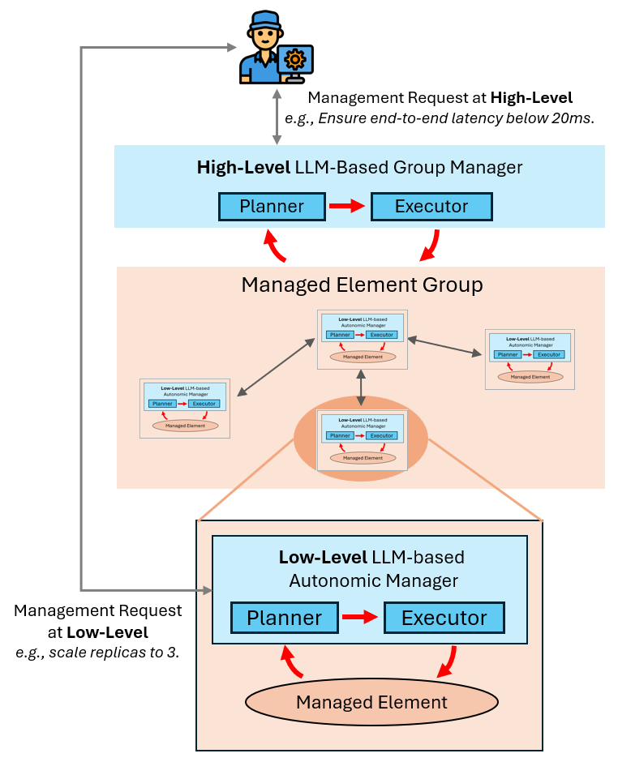
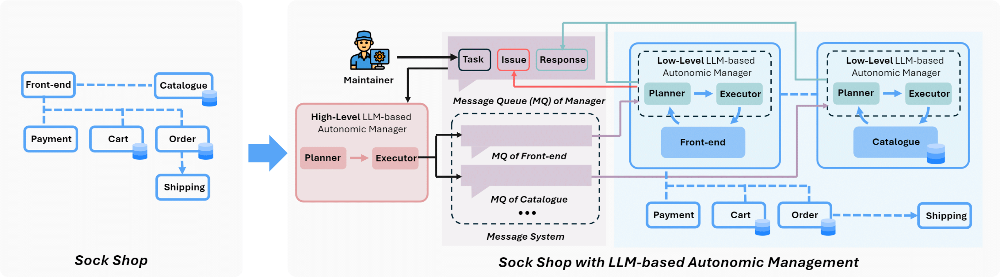

<h1 align="center">
    <b>The Vision of Autonomic Computing: Can LLMs Make It a Reality?</b>
</h1>

<div align="center">

[](https://arxiv.org/abs/2407.14402)&ensp;
&ensp;
[](https://opensource.org/licenses/MIT)&ensp;

</div>

**ACV-LLM** is a multi-agent framework designed to achieve microservice self-management in line with [The Vision of Autonomic computing](https://ieeexplore.ieee.org/abstract/document/1160055).

<h1 align="center">
    <!--   -->
    
</h1>

## Getting Started

### Step 1: Installation
Prerequisite: Linux System Environment, **[Docker](https://docs.docker.com/engine/install/)**, **[RabbitMQ](https://www.rabbitmq.com/docs/download)**

```bash
# [optional to create conda environment]
# conda create -n acv_llm python=3.11
# conda activate acv_llm

# clone the repo
git clone https://github.com/microsoft/ACV.git
cd ACV/ACV-LLM

# check if prerequisites are installed
bash scripts/check_prerequisites.sh

# install the requirements
pip install -r requirements.txt

# install required softwares, only for Ubuntu now, if you are using another system, please see setup.sh to get details
bash scripts/setup.sh
```

### Step 2: Configure the LLMs
Before running ACV-LLM, you need configure your LLMs first, those configurations will be used by `ClusterMangaer` and `Maintainer`. You should create your own config file `conf/secret.yaml`, by copying `conf/secret_template.yaml` and edit endpoint config as follows:

**OpenAI**
```yaml
backend: "OpenAI" # The backend type, "OpenAI" for the OpenAI API.
OpenAI:
  model: "gpt-4" # Only OpenAI models are supported.
  api_key: "sk-" # Your OpenAI API key.
```

**AzureOpenAI**
```yaml
backend: "AzureOpenAI" # The backend type, "AzureOpenAI" for the Azure OpenAI API.
AzureOpenAI:
  model: "my-gpt-4-deployment" # The model name in Azure OpenAI.
  api_type: "azure" # use "azure" for Azure OpenAI.
  api_key: <API_KEY> # Your Azure OpenAI API key.
  base_url: "https://ENDPOINT.openai.azure.com/" # The endpoint of your Azure OpenAI API.
  api_version: "2024-02-01" # default to "2024-02-01".
```

**Other**
```yaml
backend: "Other" # The backend type, "Other" for the local API.
Other:
  model: "llama-7B" # The model name in your local API.
  api_key: "" # Your local API key, optional.
  base_url: "http://localhost:1234" # The endpoint of your local API.
```

### Step 3: Start ACV-LLM
You can enjoy ACV-LLM now!

Execute the following command to take a first look at how ACV-LLM working:
```bash
python -m src.empirical_low_level_L1_2 \
--instance metric_collection_1 \
--suffix stable \
--cache_seed 42
```
With the code running, you can see the chat history with the agent in `results/metric_collection_1-stable.md`, and all logs is located in `logs/`.

## Reproduce Our Experiment Results

Experiment on L1 and L2 tasks applied to the low-level autonomic agent

```bash
python -m src.empirical_low_level_L1_2 \
--instance restart \
--suffix stable \
--cache_seed 42
```

Experiment on L3, L4 and L5 tasks applied to the low-level autonomic agent
```bash
python -m src.empirical_low_level_L3_4_5 \
--instance pod_failure \
--suffix stable \
--cache_seed 42
```

Experiment on L1 and L2 tasks applied to the high-level group manager
```bash
python -m src.empirical_high_level_L1_2 \
--task 'Reduce the total P99 latency of "catalogue" and "front-end" to under 400 ms.' \
--components catalogue,front-end \
--timeout 900 \
--cache_seed 42
```

Experiment on L3, L4 and L5 tasks applied to the high-level group manager
```bash
python -m src.empirical_high_level_L3_4_5 \
--instance pod_failure \
--components catalogue,front-end \
--timeout 900 \
--cache_seed 42
```

**Note:** The above commands run an experiment with one of the test cases in `data/dataset` and store the chat history in `results/`. Other test cases can be found in the `data/dataset` folder.

## Try our working machanisms

You can explore your own task in our environment. Here are some examples for you to have a try.

### Step 1: Build up evnironment
Before you start, you need to build up the environment first. You can use the following command to build up the environment:
```bash
bash scripts/create_project.sh
```

### Step 2: Design and run your own tasks

Execute following command to have a try on working machanism 1:
```bash
python -m src.working_mechanism_1 \
--task 'Report CPU usage of your component.' \
--component catalogue \
--cache_seed 42
```

Execute following command to have a try on working machanism 2:
```bash
python -m src.working_mechanism_2 \
--task 'Reduce the total P99 latency of catalogue and front-end to under 400 ms.' \
--components catalogue,front-end \
--timeout 900 \
--cache_seed 42
```

You can design your own task by changing the `--task` and `--components` parameters, explore and enjoy your trip!
### Step 3: Teardown environment
After you finish your task, you can tear down the environment by using the following command:
```bash
bash scripts/remove_project.sh
```

## Todo List
- [ ] Support more microservice demos.
- [ ] Support other multi-agent frameworks to ACV-LLM.
- [ ] Add a custom dashboard to manage the framework.
- [ ] Implement the third working mechanism.

## Contributing

This project welcomes contributions and suggestions.  Most contributions require you to agree to a
Contributor License Agreement (CLA) declaring that you have the right to, and actually do, grant us
the rights to use your contribution. For details, visit https://cla.opensource.microsoft.com.

When you submit a pull request, a CLA bot will automatically determine whether you need to provide
a CLA and decorate the PR appropriately (e.g., status check, comment). Simply follow the instructions
provided by the bot. You will only need to do this once across all repos using our CLA.

This project has adopted the [Microsoft Open Source Code of Conduct](https://opensource.microsoft.com/codeofconduct/).
For more information see the [Code of Conduct FAQ](https://opensource.microsoft.com/codeofconduct/faq/) or
contact [opencode@microsoft.com](mailto:opencode@microsoft.com) with any additional questions or comments.

## Citation

If you use ACV-LLM in your research, please cite our paper:
```BibTex
@misc{zhang2024visionautonomiccomputingllms,
      title={The Vision of Autonomic Computing: Can LLMs Make It a Reality?}, 
      author={Zhiyang Zhang and Fangkai Yang and Xiaoting Qin and Jue Zhang and Qingwei Lin and Gong Cheng and Dongmei Zhang and Saravan Rajmohan and Qi Zhang},
      year={2024},
      eprint={2407.14402},
      archivePrefix={arXiv},
      primaryClass={cs.AI},
      url={https://arxiv.org/abs/2407.14402}, 
}
```

## Trademarks

This project may contain trademarks or logos for projects, products, or services. Authorized use of Microsoft trademarks or logos is subject to and must follow [Microsoft's Trademark & Brand Guidelines](https://www.microsoft.com/en-us/legal/intellectualproperty/trademarks/usage/general).
Use of Microsoft trademarks or logos in modified versions of this project must not cause confusion or imply Microsoft sponsorship.
Any use of third-party trademarks or logos are subject to those third-party's policies.
