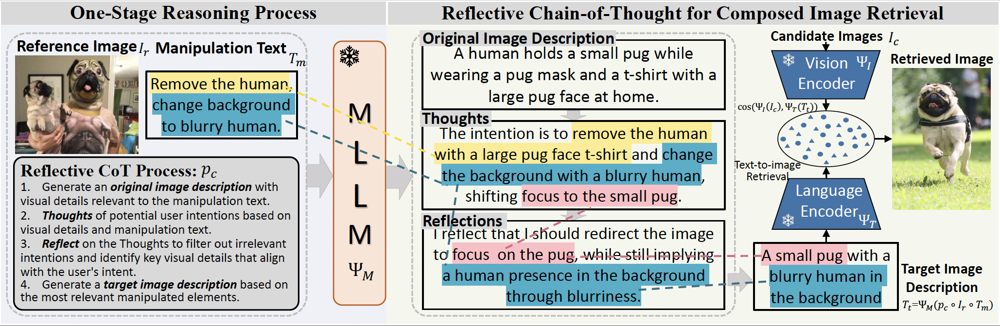

<div align="center">
	
# Reason-before-Retrieve: One-Stage Reflective Chain-of-Thoughts for Training-Free Zero-Shot Composed Image Retrieval (CVPR 2025)
[](https://arxiv.org/pdf/2412.11077)
[]()
[](https://github.com/Pter61/osrcir2024)

[](https://paperswithcode.com/sota/zero-shot-composed-image-retrieval-zs-cir-on-1?p=reason-before-retrieve-one-stage-reflective) <br/>
[](https://paperswithcode.com/sota/zero-shot-composed-image-retrieval-zs-cir-on-2?p=reason-before-retrieve-one-stage-reflective) <br/>
[](https://paperswithcode.com/sota/zero-shot-composed-image-retrieval-zs-cir-on?p=reason-before-retrieve-one-stage-reflective) 
</div>




<div align="justify">

> Composed Image Retrieval (CIR) aims to retrieve target images that closely resemble a reference image while integrating user-specified textual modifications, thereby capturing user intent more precisely. This dual-modality approach is especially valuable in internet search and e-commerce, facilitating tasks like scene image search with object manipulation and product recommendations with attribute changes. Existing training-free zero-shot CIR (ZS-CIR) methods often employ a two-stage process: they first generate a caption for the reference image and then use Large Language Models for reasoning to obtain a target description. However, these methods suffer from missing critical visual details and limited reasoning capabilities, leading to suboptimal retrieval performance. To address these challenges, we propose a novel, training-free one-stage method, One-Stage Reflective Chain-of-Thought Reasoning for ZS-CIR (OSrCIR), which employs Multimodal Large Language Models to retain essential visual information in a single-stage reasoning process, eliminating the information loss seen in two-stage methods. Our Reflective Chain-of-Thought framework further improves interpretative accuracy by aligning manipulation intent with contextual cues from reference images. OSrCIR achieves performance gains of 1.80% to 6.44% over existing training-free methods across multiple tasks, setting new state-of-the-art results in ZS-CIR and enhancing its utility in vision-language applications. 

</div>


## Contribution
1. **One-stage Reasoning**: Unlike traditional two-stage methods, OSrCIR directly processes both the reference image and modification text in a single step, reducing information loss and improving retrieval accuracy.
2. **Reflective Chain-of-Thought for Enhanced Composed Retrieval**: By leveraging MLLMs, OSrCIR better retains critical visual details, leading to more precise target image retrieval.
3. **Improved Interpretation Ability**: OSrCIR explicitly shows the alignment between modification intent and contextual cues from reference images, leading to more accurate and interpretable retrieval results.

## Status
✅ Paper accepted at **CVPR 2025**

⏳ Example code coming soon

🔜 Full release after the official publication

## Stay Updated
Watch or star this repository to get notified about the release.

## Contact
For questions or collaboration inquiries, reach out via tangyuanmin@iie.ac.cn.

## Citing

If you found this repository useful, please consider citing:

```bibtex
@misc{tang2024reasonbeforeretrieveonestagereflectivechainofthoughts,
      title={Reason-before-Retrieve: One-Stage Reflective Chain-of-Thoughts for Training-Free Zero-Shot Composed Image Retrieval}, 
      author={Yuanmin Tang and Xiaoting Qin and Jue Zhang and Jing Yu and Gaopeng Gou and Gang Xiong and Qingwei Ling and Saravan Rajmohan and Dongmei Zhang and Qi Wu},
      year={2024},
      eprint={2412.11077},
      archivePrefix={arXiv},
      primaryClass={cs.CV},
      url={https://arxiv.org/abs/2412.11077}, 
}
```

## Credits
- Thanks to [CIReVL](https://github.com/ExplainableML/Vision_by_Language) authors, our baseline code adapted from there.
