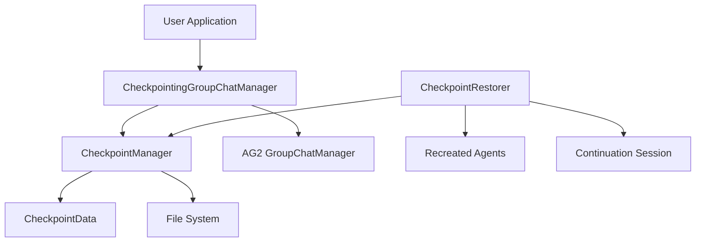

# AG2 Checkpoint System Documentation

## Table of Contents

1. [Overview](#overview)
2. [Quick Start](#quick-start)
3. [System Architecture](#system-architecture)
4. [Checkpoint Content Structure](#checkpoint-content-structure)
5. [Advanced Features](#advanced-features)
6. [Testing and Examples](#testing-and-examples)
7. [API Reference](#api-reference)
8. [Troubleshooting](#troubleshooting)

## Overview

The AG2 Checkpoint System provides robust conversation state management for multi-agent AutoGen conversations. It enables:

- **Complete State Preservation**: All agent configurations, conversation histories, and manager states
- **Intelligent Continuation**: Resume conversations from any checkpoint with additional rounds
- **Smart Pattern Detection**: Automatically detects and preserves custom termination patterns
- **Production Ready**: Clean, maintainable code suitable for production deployment

### Key Benefits

- 🔄 **Resume Interrupted Conversations**: Pick up exactly where you left off
- 🎯 **Preserve Complex Configurations**: Complete LLM configs, termination patterns, code execution settings
- 📁 **Organized Session Management**: DateTime-based directories for easy organization
- 🧪 **Thoroughly Tested**: Comprehensive test suite ensures reliability

## Quick Start

### Step 1: Generate Checkpoints

Run the MathChat example to create a conversation with automatic checkpoints:

```bash
python mathchat_with_checkpoints.py
```

**Expected Output:**
```
2025-11-16 13:02:29,740 - INFO - Session started. All logs will be saved to: logs/session_20251116_130229
2025-11-16 13:02:29,968 - INFO - Using enhanced GroupChat with checkpoints...
...
Agent_Verifier (to chat_manager):
SOLUTION_FOUND \boxed{110}
...
2025-11-16 13:02:44,946 - INFO - Total Checkpoints Created: 11
Session directory: logs/session_20251116_130229
```

**Generated Structure:**
```
logs/session_20251116_130229/
├── checkpoints/
│   ├── checkpoint_0_conversation_start_20251116_130229.json
│   ├── checkpoint_1_message_appended_20251116_130236.json
│   ├── checkpoint_2_message_appended_20251116_130236.json
│   ├── checkpoint_3_message_appended_20251116_130239.json
│   ├── checkpoint_4_message_appended_20251116_130242.json
│   ├── checkpoint_5_conversation_end_20251116_130244.json
│   └── checkpoints_metadata.json
├── chat_history.json
├── console.log
├── problem_statement.txt
├── session_metadata.json
├── final_summary.txt
└── ag2_runtime.db
```

### Step 2: Continue from a Checkpoint

Resume the conversation from any checkpoint:

```bash
# Continue from checkpoint 3 with 5 additional rounds
python test_checkpoint_continuation.py \
    logs/session_20251116_130229/checkpoints/checkpoint_3_message_appended_20251116_130239.json \
    --rounds 5
```

**Expected Output:**
```
2025-11-16 13:13:42,331 - INFO - === Checkpoint Continuation ===
2025-11-16 13:13:42,332 - INFO - ✅ Checkpoint loaded successfully
2025-11-16 13:13:42,405 - INFO - 🎯 Restored SOLUTION_FOUND termination pattern for Agent_Verifier
2025-11-16 13:13:42,420 - INFO - 🔧 Restored SOLUTION_FOUND termination pattern for manager
...
Agent_Verifier (to chat_manager):
SOLUTION_FOUND \boxed{110}
...
2025-11-16 13:13:49,107 - INFO - ✅ Conversation continuation completed successfully!
2025-11-16 13:13:49,107 - INFO - 📁 Continuation session saved to: logs/session_20251116_130229/continuation_20251116_131342
```

**Continuation Structure:**
```
logs/session_20251116_130229/continuation_20251116_131342/
├── checkpoints/
│   ├── checkpoint_3.5_speaker_reply_generated_20251116_131347.json
│   ├── checkpoint_4_message_appended_20251116_131347.json
│   ├── checkpoint_5_message_appended_20251116_131349.json
│   └── checkpoint_5_continuation_end_20251116_131349.json
└── continuation_metadata.json
```

### Step 3: Explore Different Checkpoint Points

You can continue from any checkpoint to explore different conversation paths:

```bash
# Continue from the beginning
python test_checkpoint_continuation.py \
    logs/session_20251116_130229/checkpoints/checkpoint_0_conversation_start_20251116_130229.json \
    --rounds 10

# Continue from middle of conversation
python test_checkpoint_continuation.py \
    logs/session_20251116_130229/checkpoints/checkpoint_2_message_appended_20251116_130236.json \
    --rounds 8
```

## System Architecture

### Component Overview



### Core Classes

1. **`CheckpointManager`** (`core.py`)
   - Manages checkpoint creation and serialization
   - Handles agent/manager state extraction
   - Provides checkpoint metadata tracking

2. **`CheckpointingGroupChatManager`** (`wrappers.py`)
   - Wraps AG2's GroupChatManager
   - Adds automatic checkpointing at conversation milestones
   - Preserves all original AG2 functionality

3. **`CheckpointRestorer`** (`restoration.py`)
   - Loads checkpoints and recreates conversation state
   - Handles agent recreation with proper configurations
   - Manages continuation session organization

4. **`CheckpointData`** (`core.py`)
   - Data structure for checkpoint representation
   - Serializable to/from JSON
   - Contains complete conversation state

## Checkpoint Content Structure

### Complete Checkpoint Example

```json
{
  "checkpoint_id": "checkpoint_3_message_appended_20251116_130239",
  "timestamp": "2025-11-16T13:02:39.978866",
  "step_number": 3,
  "context": "message_appended",
  "messages": [
    {
      "content": "Gerald works at a daycare...",
      "role": "assistant",
      "name": "Agent_Verifier"
    },
    {
      "content": "Let's break down the problem...",
      "role": "assistant", 
      "name": "Agent_Problem_Solver"
    },
    {
      "content": "```python\n# Calculate Gerald's total earnings...",
      "role": "assistant",
      "name": "Agent_Code_Executor"
    }
  ],
  "agent_states": {
    "Agent_Problem_Solver": {
      "name": "Agent_Problem_Solver",
      "system_message": "You are Agent Problem Solver...",
      "human_input_mode": "NEVER",
      "llm_config": {
        "max_tokens": 4096,
        "model": "gpt-4.1-nano-20250414",
        "base_url": "https://api.openai.com/v1",
        "api_type": "azure",
        "api_version": "2025-04-01-preview"
      },
      "code_execution_config": false,
      "termination_pattern": null,
      "_oai_messages": {
        "Agent_Code_Executor": [...],
        "Agent_Verifier": [...]
      }
    },
    "Agent_Code_Executor": {
      "name": "Agent_Code_Executor",
      "code_execution_config": {"work_dir": "coding", "use_docker": false},
      "termination_pattern": null,
      "llm_config": {...},
      "_oai_messages": {...}
    },
    "Agent_Verifier": {
      "name": "Agent_Verifier", 
      "termination_pattern": "SOLUTION_FOUND",
      "llm_config": {...},
      "_oai_messages": {...}
    }
  },
  "manager_state": {
    "name": "chat_manager",
    "system_message": "You are a chat manager facilitating...",
    "human_input_mode": "NEVER",
    "_last_speaker": "Agent_Code_Executor",
    "_max_consecutive_auto_reply": 3,
    "step_counter": 6,
    "current_speaker": "Agent_Code_Executor",
    "llm_config": {
      "max_tokens": 4096,
      "model": "gpt-4.1-nano-20250414",
      "base_url": "https://api.openai.com/v1",
      "api_type": "azure",
      "api_version": "2025-04-01-preview"
    },
    "termination_pattern": "SOLUTION_FOUND"
  },
  "metadata": {
    "session_dir": "session_20251116_130229",
    "problem_context": "Gerald works at a daycare that pays him $30 every day..."
  }
}
```

### Key Data Elements

| Element | Description | Critical for Restoration |
|---------|-------------|-------------------------|
| `agent_states.*.llm_config` | Complete LLM configuration | ✅ Yes |
| `agent_states.*.termination_pattern` | Custom termination detection | ✅ Yes |
| `agent_states.*._oai_messages` | Conversation histories | ✅ Yes |
| `agent_states.*.code_execution_config` | Code execution settings | ✅ Yes |
| `manager_state.termination_pattern` | Manager termination logic | ✅ Yes |
| `messages` | GroupChat message sequence | ✅ Yes |

## Advanced Features

### Termination Pattern Detection

The system automatically detects termination patterns by testing responses:

```python
# Test messages used for detection
solution_msg = {"content": "SOLUTION_FOUND"}
terminate_msg = {"content": "TERMINATE"}

# Classification logic:
if responds_to_solution and not responds_to_terminate:
    pattern = "SOLUTION_FOUND"  # Custom math problem termination
elif not responds_to_solution and responds_to_terminate:
    pattern = None  # Default AG2 termination
elif responds_to_solution and responds_to_terminate:
    pattern = "SOLUTION_FOUND"  # Combined pattern
else:
    pattern = "custom"  # Other custom logic
```

### LLM Configuration Preservation

Complete LLM configurations are serialized including:

```python
# Captured configuration elements
{
    "model": "gpt-4.1-nano-20250414",
    "base_url": "https://api.openai.com/v1",
    "api_type": "azure", 
    "api_version": "2025-04-01-preview",
    "max_tokens": 4096,
    "temperature": 0.7,
    "top_p": 0.9,
    # ... other model parameters
    # Note: API keys and tokens are excluded for security
}
```

### Conversation History Management

Agent-to-agent conversation histories are preserved:

```python
# Example _oai_messages structure
{
    "Agent_Problem_Solver": [
        {"content": "Let me solve this step by step...", "role": "assistant"},
        {"content": "Here's my solution...", "role": "assistant"}
    ],
    "Agent_Code_Executor": [
        {"content": "```python\ncode here...", "role": "assistant"}
    ]
}
```

## Testing and Examples

### Available Test Scripts

| Script | Purpose | Usage |
|--------|---------|-------|
| `mathchat_with_checkpoints.py` | Generate checkpoints | `python mathchat_with_checkpoints.py` |
| `test_checkpoint_continuation.py` | Test continuation | `python test_checkpoint_continuation.py <checkpoint> --rounds N` |
| `test_mathchat_checkpoints.py` | Comprehensive testing | `python test_mathchat_checkpoints.py` |
| `test_checkpoint_restoration.py` | Restoration testing | `python test_checkpoint_restoration.py` |

### Testing Workflow

1. **Generate Test Data:**
```bash
python mathchat_with_checkpoints.py
# Creates: logs/session_YYYYMMDD_HHMMSS/
```

2. **Test Different Continuation Points:**
```bash
# From start
python test_checkpoint_continuation.py logs/session_*/checkpoints/checkpoint_0_*.json --rounds 5

# From middle  
python test_checkpoint_continuation.py logs/session_*/checkpoints/checkpoint_3_*.json --rounds 5

# From near end
python test_checkpoint_continuation.py logs/session_*/checkpoints/checkpoint_4_*.json --rounds 3
```

3. **Verify Results:**
```bash
# Check continuation directories
ls logs/session_*/continuation_*/

# Review continuation logs
cat logs/session_*/continuation_*/checkpoints/checkpoints_metadata.json
```

### Example Test Output

**Successful Restoration:**
```
2025-11-16 13:13:42,405 - INFO - 🎯 Restored SOLUTION_FOUND termination pattern for Agent_Verifier
2025-11-16 13:13:42,420 - INFO - 🔧 Restored SOLUTION_FOUND termination pattern for manager
2025-11-16 13:13:49,107 - INFO - ✅ Conversation continuation completed successfully!
```

**Proper Termination:**
```
Agent_Verifier (to chat_manager):
SOLUTION_FOUND \boxed{110}
--------------------------------------------------------------------------------
>>>>>>>> TERMINATING RUN: Termination message condition on the GroupChatManager 'chat_manager' met
```

## API Reference

### CheckpointManager

```python
class CheckpointManager:
    def __init__(self, session_dir: Union[str, Path])
    
    def save_checkpoint(self, checkpoint_data: CheckpointData) -> bool
        """Save a checkpoint to disk with proper error handling."""
    
    def load_checkpoint(self, checkpoint_id: str) -> CheckpointData
        """Load a checkpoint from disk by ID."""
    
    def create_conversation_checkpoint(
        self, agents: List, manager, messages: List, 
        step_number: int, context: str
    ) -> CheckpointData
        """Create a complete conversation checkpoint."""
    
    def _extract_agent_states(self, agents: List) -> Dict[str, Dict]
        """Extract complete state from all agents including termination patterns."""
    
    def _extract_manager_state(self, manager) -> Dict[str, Any]
        """Extract complete state from GroupChatManager including termination patterns."""
```

### CheckpointingGroupChatManager

```python
class CheckpointingGroupChatManager(GroupChatManager):
    def __init__(
        self, checkpoint_manager: CheckpointManager,
        problem_context: str = "", **kwargs
    )
    
    def save_checkpoint(self, context: str = "manual") -> Optional[str]
        """Save a checkpoint at current conversation state."""
    
    def continue_from_loaded_state(
        self, max_additional_rounds: int = 10
    ) -> Tuple[bool, str]
        """Continue conversation from loaded state with additional rounds."""
```

### CheckpointRestorer

```python
class CheckpointRestorer:
    def continue_conversation_from_checkpoint(
        self, checkpoint_file: Union[str, Path], max_rounds: int = 10
    ) -> bool
        """Complete workflow for continuing from a checkpoint file."""
    
    def recreate_agents_from_checkpoint(
        self, agent_states: Dict, token_provider=None
    ) -> List[ConversableAgent]
        """Recreate agents with complete configurations and termination patterns."""
    
    def restore_agent_message_histories(
        self, agents: List, chat_manager
    ) -> None
        """Restore agent-to-agent conversation histories."""
```

### Utility Functions

```python
def load_checkpoint_from_file(checkpoint_file: Union[str, Path]) -> CheckpointData
    """Load checkpoint from JSON file."""

def create_checkpoint_manager(session_dir: Union[str, Path]) -> CheckpointManager
    """Factory function for creating checkpoint managers."""
```

## Troubleshooting

### Common Issues and Solutions

#### 1. Missing LLM Configuration After Restoration

**Symptoms:**
```
ERROR: Agent creation failed - missing LLM config
```

**Solution:**
```python
# Ensure LLM config is properly set during original agent creation
agent = ConversableAgent(
    name="test_agent",
    llm_config=llm_config,  # Must be complete LLMConfig object
    # ... other parameters
)
```

#### 2. Termination Pattern Not Working

**Symptoms:**
- Conversation doesn't terminate on expected patterns
- Wrong termination pattern detected

**Debugging:**
```python
# Check checkpoint content
import json
with open("checkpoint_file.json") as f:
    data = json.load(f)
    print("Agent termination patterns:")
    for agent_name, state in data["agent_states"].items():
        print(f"  {agent_name}: {state.get('termination_pattern')}")
    print(f"Manager termination pattern: {data['manager_state'].get('termination_pattern')}")
```

**Solution:**
```python
# Ensure consistent termination pattern definition
termination_lambda = lambda msg: "SOLUTION_FOUND" in (msg.get("content", "") or "")

# Apply to both agents and manager
agent = ConversableAgent(
    name="verifier",
    is_termination_msg=termination_lambda
)

chat_manager = CheckpointingGroupChatManager(
    is_termination_msg=termination_lambda,
    # ... other parameters  
)
```

#### 3. Code Execution Errors After Restoration

**Symptoms:**
```
python: can't open file '': [Errno 2] No such file or directory
```

**Solution:**
```python
# Ensure code_execution_config is properly set
agent = ConversableAgent(
    name="code_executor", 
    code_execution_config={
        "work_dir": "coding",
        "use_docker": False
    }
)
```

#### 4. Directory Permission Issues

**Symptoms:**
```
PermissionError: [Errno 13] Permission denied: 'checkpoint_file.json'
```

**Solution:**
```bash
# Ensure proper permissions
chmod 755 logs/
chmod 644 logs/session_*/checkpoints/*.json
```

### Debugging Tips

1. **Enable Debug Logging:**
```python
import logging
logging.getLogger('checkpoint_system').setLevel(logging.INFO)
```

2. **Validate Checkpoint Content:**
```bash
# Check checkpoint structure
python -m json.tool checkpoint_file.json | head -50
```

3. **Test Agent Recreation:**
```python
# Test individual agent recreation
from checkpoint_system.restoration import CheckpointRestorer
restorer = CheckpointRestorer()
agents = restorer.recreate_agents_from_checkpoint(agent_states)
```

4. **Compare Original vs Restored:**
```python
# Compare configurations before and after
print("Original agent config:", original_agent.llm_config)
print("Restored agent config:", restored_agent.llm_config)
```

## Best Practices

### 1. Checkpoint Frequency
- Create checkpoints at natural conversation boundaries
- Avoid excessive checkpointing (impacts performance)
- Always checkpoint before/after critical decisions

### 2. Configuration Management
- Use complete LLMConfig objects (not dictionaries)
- Ensure all authentication is properly configured
- Test configurations work before checkpointing

### 3. Session Organization
```bash
# Good structure
logs/
├── session_20251116_130229/          # Original session
│   ├── checkpoints/
│   ├── continuation_20251116_131342/  # First continuation
│   └── continuation_20251116_142156/  # Second continuation
└── session_20251116_150445/          # Different problem
    └── checkpoints/
```

### 4. Testing Workflows
- Test checkpoint creation with your specific configurations
- Validate restoration before deploying to production  
- Create test scenarios for different conversation flows
- Verify termination patterns work as expected

### 5. Error Handling
```python
try:
    success = restorer.continue_conversation_from_checkpoint(checkpoint_file, max_rounds=10)
    if not success:
        logger.error("Continuation failed")
except Exception as e:
    logger.error(f"Checkpoint restoration error: {e}")
```

## Advanced Usage Examples

### Custom Agent with Specific Configurations

```python
from checkpoint_system import CheckpointManager, CheckpointingGroupChatManager
from autogen import ConversableAgent, GroupChat, LLMConfig

# Custom LLM configuration
custom_llm_config = LLMConfig(
    model="gpt-4-turbo",
    temperature=0.3,
    max_tokens=2048,
    base_url="https://your-endpoint.com/",
    api_type="azure",
    api_version="2024-02-15-preview"
)

# Specialized agent
specialist = ConversableAgent(
    name="domain_expert",
    system_message="You are a domain expert in mathematical optimization.",
    llm_config=custom_llm_config,
    is_termination_msg=lambda msg: "OPTIMIZATION_COMPLETE" in msg.get("content", ""),
    code_execution_config={
        "work_dir": "optimization",
        "use_docker": False,
        "timeout": 30
    }
)

# Create checkpoint-enabled conversation
checkpoint_manager = CheckpointManager("./optimization_session")
groupchat = GroupChat(agents=[specialist], messages=[])

chat_manager = CheckpointingGroupChatManager(
    checkpoint_manager=checkpoint_manager,
    groupchat=groupchat,
    is_termination_msg=lambda msg: "PROBLEM_SOLVED" in msg.get("content", ""),
    problem_context="Mathematical optimization problem"
)
```

### Batch Checkpoint Processing

```python
import glob
from pathlib import Path

def process_all_checkpoints(session_dir: str, max_rounds: int = 5):
    """Continue conversations from all checkpoints in a session."""
    checkpoint_pattern = f"{session_dir}/checkpoints/checkpoint_*.json"
    checkpoint_files = glob.glob(checkpoint_pattern)
    
    results = {}
    for checkpoint_file in sorted(checkpoint_files):
        checkpoint_path = Path(checkpoint_file)
        checkpoint_id = checkpoint_path.stem
        
        try:
            restorer = CheckpointRestorer()
            success = restorer.continue_conversation_from_checkpoint(
                checkpoint_file, max_rounds
            )
            results[checkpoint_id] = "success" if success else "failed"
        except Exception as e:
            results[checkpoint_id] = f"error: {e}"
    
    return results

# Usage
results = process_all_checkpoints("logs/session_20251116_130229", max_rounds=3)
for checkpoint_id, status in results.items():
    print(f"{checkpoint_id}: {status}")
```

This comprehensive documentation provides everything needed to understand, implement, and troubleshoot the AG2 Checkpoint System. The quick start section demonstrates the core workflow, while the detailed sections cover advanced usage and problem-solving scenarios.